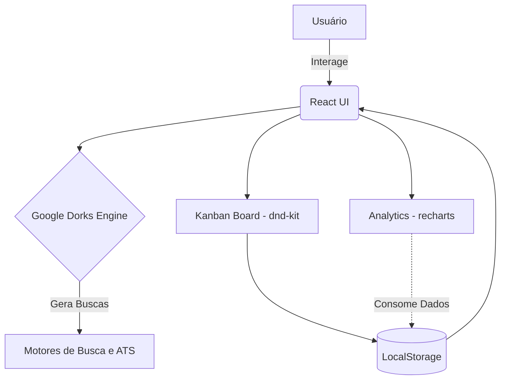

# 💼 JobTracker


## 🧠 Abstract

O JobTracker é uma solução desenvolvida para revolucionar a busca por emprego na área de tecnologia, transformando uma atividade manual e desgastante em um processo estratégico e metrificado. O projeto resolve o problema da desorganização na gestão de candidaturas e da ineficiência nas buscas tradicionais, centralizando a jornada do candidato em uma única plataforma inteligente.

Seu objetivo principal é fornecer aos usuários ferramentas avançadas de pesquisa, utilizando Google Dorks para encontrar vagas ocultas ou altamente específicas, além de um painel Kanban para acompanhamento visual do funil de aplicações, desde o momento em que a vaga é salva até a oferta ou rejeição.

## ⚙️ Core Architecture

A arquitetura do JobTracker baseia-se em uma Single Page Application (SPA) reativa e totalmente no lado do cliente (Client-Side). O núcleo da aplicação é construído em **React** (via Vite), tipado com **TypeScript** e estilizado utilizando **Tailwind CSS**. 

A persistência de dados é tratada de forma local através da API do `LocalStorage`, garantindo que todas as informações, como as vagas salvas, configurações de tema e estatísticas de uso, sobrevivam a atualizações de página. O sistema de Kanban e drag-and-drop é potencializado pela biblioteca `@dnd-kit`, enquanto os gráficos analíticos são gerados utilizando o `recharts`.



## 🚀 Key Features

* **Motor de Busca Inteligente:** Criação automática de queries complexas (Google Dorks) para encontrar vagas assertivas.
* **Kanban Board Drag & Drop:** Acompanhamento dinâmico das candidaturas através das colunas: Salvas, Aplicadas, Entrevista, Oferta e Rejeitadas.
* **Dashboard Analítico:** Visualização de dados em tempo real sobre a performance e as estatísticas das buscas e aplicações.
* **Suporte Multi-plataforma e ATS:** Busca integrada em mais de 30 portais pré-configurados (Gupy, LinkedIn, Greenhouse, etc).
* **Persistência Total:** Funcionamento ágil sem necessidade de backend, com dados salvos de forma segura e rápida diretamente no navegador do usuário.

<details>
<summary>Visualizar Imagem</summary>

</details>

## 🛠️ Repository Structure

```bash
📦 JobTracker
 ┣ 📂 public/              # Arquivos públicos e assets estáticos
 ┣ 📂 src/                 # Código-fonte principal da aplicação
 ┃ ┣ 📂 assets/            # Imagens e ícones
 ┃ ┣ 📂 components/        # Componentes React reutilizáveis
 ┃ ┣ 📂 hooks/             # Custom Hooks do React
 ┃ ┣ 📂 lib/               # Utilitários e configurações
 ┃ ┣ 📂 types/             # Tipagens do TypeScript
 ┃ ┣ 📜 App.tsx            # Componente raiz da aplicação
 ┃ ┣ 📜 index.css          # Estilos globais (Tailwind)
 ┃ ┗ 📜 main.tsx           # Ponto de entrada do React
 ┣ 📜 tailwind.config.js   # Configurações do Tailwind CSS
 ┣ 📜 vite.config.ts       # Configurações do Vite
 ┗ 📜 package.json         # Dependências e scripts do projeto
```

## 💻 Quick Start

Siga os passos abaixo para configurar e rodar o projeto no seu ambiente local:

1. **Clone o repositório:**
   ```bash
   git clone https://github.com/ithiagojs/jobtracker.git
   ```
2. **Acesse o diretório do projeto:**
   ```bash
   cd jobtracker
   ```
3. **Instale as dependências:**
   ```bash
   npm install
   ```
4. **Inicie o servidor de desenvolvimento:**
   ```bash
   npm run dev
   ```
5. **Acesse no navegador:**  
   Abra `http://localhost:5173` para visualizar o JobTracker.

## 📄 License

Distribuído sob a Licença MIT.